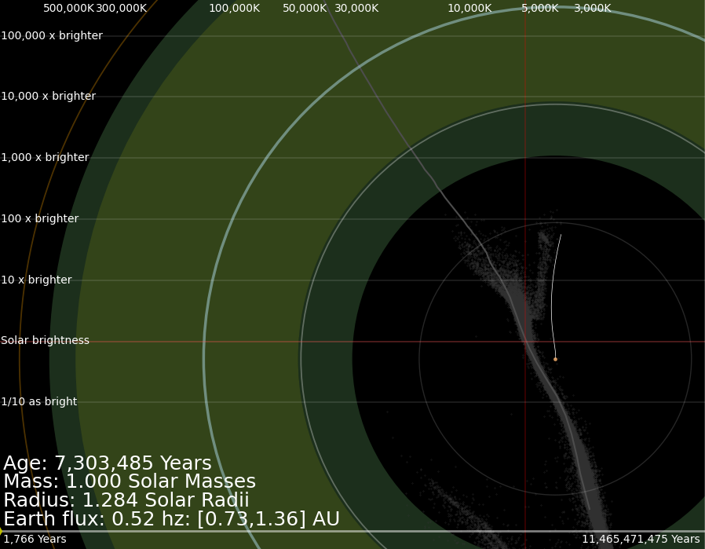
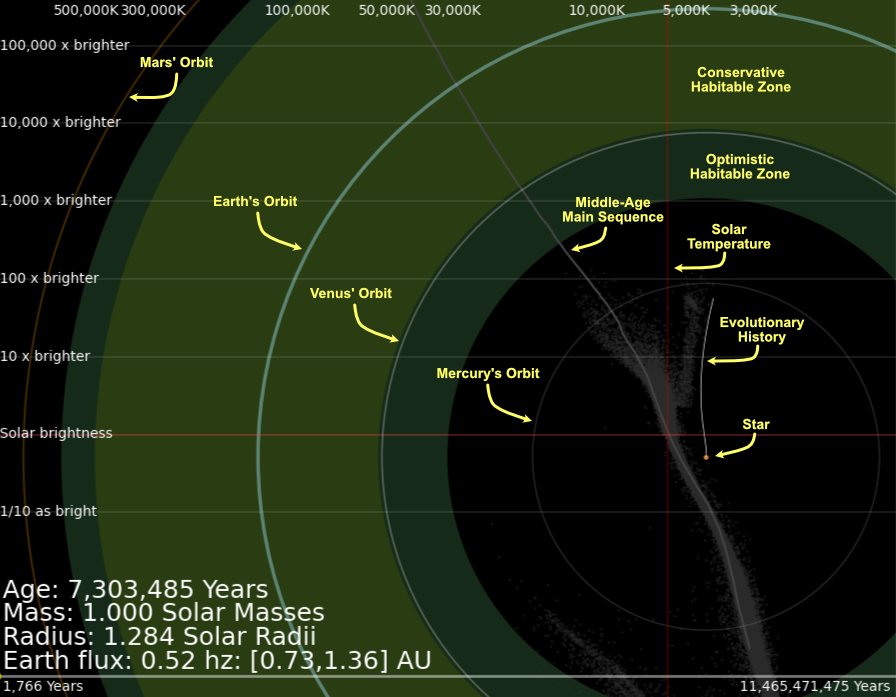

<h3>Quick Start (assuming you have Anaconda python)</h3>

<ul>
  <li> Download/clone this repository, and cd into its directory in a terminal
  <li> <code>pip install isochrones</code> (just the first time)
  <li> <code>python star_evolution_animation.py</code>
</ul>

___

1. [Introduction](#intrp)
2. [How to Install](#install)
3. [How to Run](#run)
4. [Interaction During the Animation](#interact)

___

<h3>Introduction</h3>

An animation of stellar evolution, showing both motion on the HR diagram and changes in the star size and habitable zones.  This animation is based on [Tim Morton's isochrones package](https://isochrones.readthedocs.io/en/latest/) and [Kopperapu et al's definition of the habitable zone](https://iopscience.iop.org/article/10.1088/0004-637X/765/2/131)

If you run for a little while with the command <code>python star_evolution_animation.py</code>, you'll see something like this:

Star_evolution_animation plots two kinds of things on the same figure:
<ul>
  <li>The star's position on the HR diagram with coordinates (effective temperature, intrinsic brightness).  The temperature values are at the top of the figure, and the brightness values relative to the Sun's intrinsic brightness are on the left</li>
  <li>The star's radius is drawn as a disk in arbitrary units that have nothing to do with the HR diagram.  The color of the disk shows the human perceptual color of a blackbody at that color, from http://www.vendian.org/mncharity/dir3/blackbody/. The radii of the habitable zones, Solar System classical planet orbits, and large reference circles are shown on the same scale, called the Solar System Scale, centered on the (moving) position of the star in the HR diagram.</li>
</ul>
There is also text display of 
<ul>
  <li>The star's age</li>
  <li>The star's mass, which changes over time</li>
  <li>The star's radius</li>
  <li>The amount of the star's energy flux at the Earth's orbit, compared to our current flux</li>
  <li>The inner and outer radius of the conservative habitable zone in Astronomical Units (AU)</li>
</ul>
Red horizontal and vertical lines show the Sun's intrincic brightness and effective temperature.

At the bottom is a time display, where the yellow pip shows the current time of the animation (which is at the very beginning in this figure).  Animation time does not flow linearly: it is much slower when there is a lot happening at the beginning and end of the star's life, and it flows much faster when there is not much happening, which is most of the star's life.

Here is an annotated version of the same figure:

<h4>HR Diagram Features</h4>

The [HR Diagram](https://en.wikipedia.org/wiki/Hertzsprung–Russell_diagram) is a common tool that astronomers use to track and classify stars.  

The star's position on the HR diagram is determined by its effective temperature and intrinsic brightness, which changes considerably over the life of the star.  The evolutionary history of the star's temperature and brightness up to the current animation time is drawn as a white line.  

Most stars, for most of their lives, fall on a roughly diagonal line called the Main Sequence.  The star's location on the main sequence is determined primarily by its mass and metalicity (fraction of elements heavier than helium).  The main sequence of a middle-aged star is shown by a grey mostly diagonal curve.  The faint grey dots are a subset of stars from the [Gaia catalog of nearby stars](https://gucds.inaf.it/GCNS/Original/).

<h4>Star Size Features</h4>

Circles showing the average planet orbits are drawn to provide a sense of the scale of the star's radius.  The Earth's orbit is a thicker blue circle.  Later in the star's life, as the star becomes a red giant, you will see its size become larger than the orbits of Mercury and Venus.  The planet orbits only show their current (average) distance from the sun.  The animation does not account for how these orbits would change as the star changes mass.

The habitable zone is the range of distances from a star where a planet would have the right temperature to allow liquid water.  A planet's temperature depends on the planet's atmosphere. There are two versions of the habitable zone: 
<ul>
  <li>The conservative habitable zone where temeratures on a planet would allow liquid water for most types of planet atmospheres</li>
  <li>The optimistic habitable zone, where temparatures might allow liquid water if the atmosphere were just right</li>
</ul>

The conservative habitable zone is drawn in olive green, and the larger conservative habitable zone is drawn in dark green.  As the star's size and brightness changes, the habitable zone's size will change: a brighter and/or larger star will cause the habitable zone to more outwards.

<h5>Zooming Out</h5>

You can set the Solar System scale either using command line arguments or with the ',' and '.' keys.  Zooming does not effect the HR diagram components such as the main sequence or the star location.  Zooming only changes the displayed star radius, planet orbits and the habitable zones.

If you start up with <code>python star_evolution_animation.py -s 20</code>, you'll see the planets out to Uranus.  If you let the animation run to the end of the star's life, you'll see that the star becomes almost as big as the Earth's orbit:

You can't see the habitable zone because it has become much larger than Uranus' orbit.  

If you start up with <code>python star_evolution_animation.py -s 5000</code> and run to about the same time, you'll see the habitable zone.  Because there are no planet orbits at this scale, green circles are drawn at 100, 200, 500, 1000, 2000, 3000, 4000, and 5000 Astronomical Units (AU).  We also see a white circle at 0.1 light years (ly).  Because the star is a red giant the habitable zone reaches out almost to 0.1 light years!

We can zoom out a factor of 10 further by starting with <code>python star_evolution_animation.py -s 50000</code>.  We now see white circles at 0.1, 0.2, 0.3, 0.4, 0.5, 0.6, 0.7, 0.8, and 0.9 light years (ly).  If we run to slightly later in the star's life, we see the habitable zone reaches out beyond 0.1 light years (for a very short time).  

If we ran with a more massive star, for example <code>python star_evolution_animation.py -m 5 -s 50000</code>, the habitable zone would run out beyond 0.9 light years.

___

<h3>How to Install</h3>

Requirements: a good scientific python 3.10 or later environment that includes the astropy package.  Installing Anaconda is the easiest way to create this environment.

You need the isochrones package, which can be installed with <code>pip install isochrones</code>

___

<h3>How to Run</h3>

Clone or download this repository.  Then in the repository directory, run by typing the following on the command line:
<code>python star_evolution_animation.py</code>,
which simulates a 1 Solar mass star with Solar metallicity.

There are three startup options:

<code>python star_evolution_animation.py -m M</code> sets the initial stellar mass to M Solar masses (default M=1)

<code>python star_evolution_animation.py -f F</code> sets the initial stellar metallicity to F (default F=0, Solar metallicity)

<code>python star_evolution_animation.py -s S</code> sets the Solar System scale to S (default S=1)

So, for example, <code>python star_evolution_animation.py -m 2 -f 0.25 -s 100</code> simulates a 2-Solar-mass star with metallicity 0.25 zoomed out from the default scale by a factor of 100.

You can see these options by typing <code>python star_evolution_animation.py --help</code>, which prints       
<pre>usage: star_evolution_animation.py [-h] [-m STARMASS] [-f STARMETALLICITY] [-s SSSCALE]

options:
  -h, --help            show this help message and exit
  -m STARMASS, --starMass STARMASS
                        star mass in Solar masses in range [0.1,300]
  -f STARMETALLICITY, --starMetallicity STARMETALLICITY
                        star metallicity relative to the sun in dex in range [-4, 0.5]
  -s SSSCALE, --ssScale SSSCALE
                        Solar System scale
</pre>

Star_evolution_animation uses grids in stellar mass and metallicity from the isochrones package.  If you specify a mass or metallicity that is not on that grid, the mass or metallicity will be rounded up to the next value that is on the grid.

___

<h3>Interaction During the Animation<a id="interact"></h3>
While the animation is running, you can 
<ul>
  <li>Right-click in the animation window to pause and resume the animation.</li>
  <li>Press the ',' and '.' key to zoom the scale in and out.  This does not work when the animation is paused.</li>
</ul>

___

This software is a for-fun side project and is offered as-is, with no support or maintainence.  
